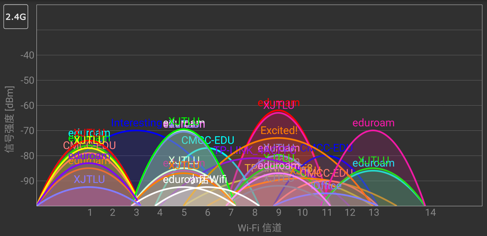
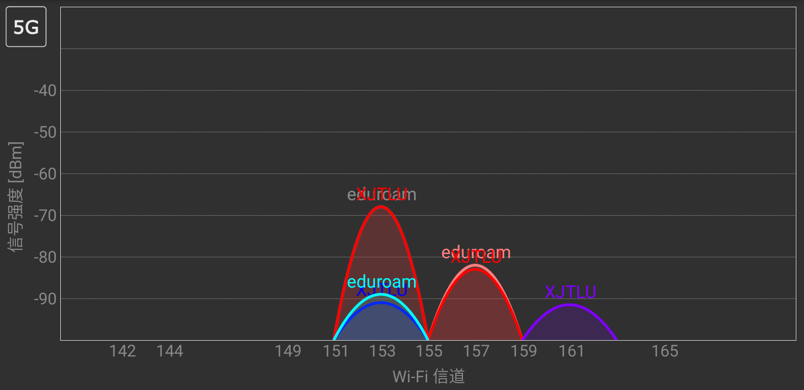
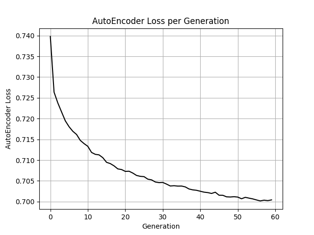
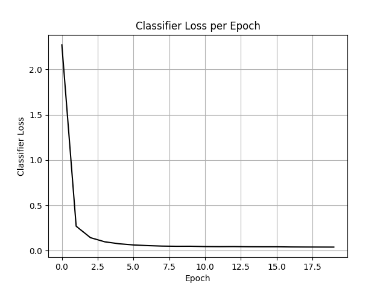
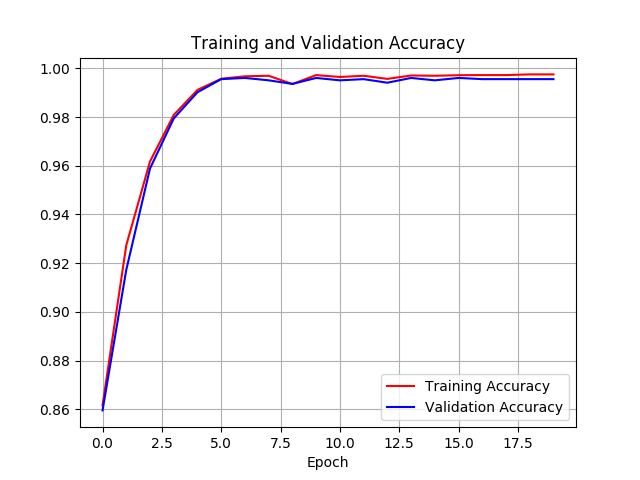

# SURF-Indoor-Localization

## Overall:
2017 SURF: Indoor Localization </br>
Mainly relevant essential material, files and code. </br>
Hope this summer can be cool. </br>

The main idea is from [Low-effort place recognition with WiFi fingerprints using deep learning](https://arxiv.org/abs/1611.02049) and the implementation based on this [repo](https://github.com/aqibsaeed/Place-Recognition-using-Autoencoders-and-NN) with slight modifications. 


## Folders:
- algorithm: holding relevant code for offline
- android: holding code of app for online
- Papers: relevant papers for research

## Problems:
1. In deep learning algorithm, the testing accuracy is much lower than training and validation.
- ~~an strong relation between loss of AutoEncoder and final testing accuracy was observed. May be we should design a better AutoEncoder if necessary~~


Solving: This problem mainly blames to the preprocessing of the data. In the data base, the non-detected APs are represented as 100 but it is much better to use -110. In addition, when scaling the original data, it is better to jointly scaling them rather than independently. 

2. **_"Detection Delay"_**: In practical case testing, the returned label is always be the previous location. For instance, just having finished test at location labeled as 6, we move to the location labeled as 0 and test the system; but the returned label is still 6 for the first 2 or 3 detection. 

Solving: It can be resulted from the android part which we use to detect and send the RSS information. Initially, we thought the lack of detection existed when changing location and this problem can be simply resolved by simply setting the program to madly scanning the signal in order to refresh the detected results. Unfortunately, however, this solution didn't work. After searching on the Internet, we figure it out from a similar question on [stackoverflow](https://stackoverflow.com/questions/7969174/reducing-delay-between-two-wifi-scans). It is related to the frequency channels about WLAN. In our case, the distribution of signals in frequency channels can be illustrated as figures below.




From those plot we can see that signals from all the access points on this floor occupy 13 frequency channels which implies we need at least 1.3s to guarantee the accuracy of detection as an access point broadcasts a beacon roughly every 100 ms. 

$$T = 100ms \times 13 = 1.3s$$

Thus, we choose 1.5s as the gap between each detection of signals. The result seems not bad.

## Visualized model result:

The lastest version of model has follwing settings:
- Resetting the ratio of training and validation 0.9
- Dropout with 0.5
- Use tanh in autoencoder while relu in classifier

Here are some plots of evaluation critera




Theoretically, this model can provide a 91~93% accuracy. Whether this model works or not in practical condition needs proof. 
Now we need to establish our own database which might have more than 100 APs that much more smaller than 520 in [UJIndoorLoc](https://archive.ics.uci.edu/ml/datasets/ujiindoorloc) database. Thus, the internal structure may need modifications such as the number of units in hidden layer and the number of layers in autoencoder which is better to be smaller as the dimension of raw RSS data inputs is much more smaller.

## APs in EE 4th floor:

There are, initially, 143 APs detected but, as some rooms are not accessible, the total number might be more than that. We are trying to use this as the input dimension and -110 representing lack of signal for an AP. To check whether this systems can work, we use 200 as the scale of the total APs which are shown as below:
```
BSSID 	             NO.
00:1e:a8:08:bc:a3 	 36
00:34:cb:48:94:aa 	 198
00:71:cc:2b:d0:7f 	 91
0a:18:d6:95:93:1e 	 56
0e:18:d6:95:93:1e 	 0
12:18:d6:95:93:1e 	 42
28:2c:b2:fd:07:b9 	 181
38:46:08:c9:87:0c 	 39
3c:46:d8:58:64:c9 	 75
4c:e6:76:64:df:00 	 96
4c:fa:ca:1f:41:40 	 192
52:a5:89:79:19:ab 	 182
6e:72:e7:3f:05:1e 	 126
78:eb:14:e7:2a:82 	 172
80:89:17:e8:e7:f8 	 18
88:25:93:61:65:78 	 55
8c:ab:8e:13:aa:3c 	 127
8c:f2:28:27:62:84 	 179
90:72:40:16:ca:00 	 188
9c:50:ee:30:30:80 	 108
9c:50:ee:30:30:81 	 32
9c:50:ee:30:30:c0 	 14
9c:50:ee:30:30:c1 	 123
9c:50:ee:30:31:20 	 45
9c:50:ee:30:31:21 	 52
9c:50:ee:30:34:00 	 155
9c:50:ee:30:35:01 	 41
9c:50:ee:30:36:80 	 135
9c:50:ee:30:36:81 	 8
9c:50:ee:30:37:a0 	 98
9c:50:ee:30:37:a1 	 74
9c:50:ee:30:38:c1 	 97
9c:50:ee:30:39:e0 	 129
9c:50:ee:30:39:e1 	 65
9c:50:ee:30:3d:c0 	 105
9c:50:ee:30:3f:c0 	 30
9c:50:ee:30:3f:c1 	 116
9c:50:ee:30:42:20 	 196
9c:50:ee:30:42:21 	 22
9c:50:ee:30:43:01 	 88
9c:50:ee:30:45:20 	 7
9c:50:ee:30:45:21 	 64
9c:50:ee:30:45:60 	 62
9c:50:ee:30:45:61 	 94
9c:50:ee:30:45:c0 	 6
9c:50:ee:30:45:c1 	 165
9c:50:ee:30:46:20 	 191
9c:50:ee:30:46:21 	 21
9c:50:ee:3f:71:80 	 148
9c:50:ee:3f:71:81 	 68
9c:50:ee:3f:71:e0 	 81
9c:50:ee:3f:71:e1 	 153
9c:50:ee:3f:72:a0 	 150
9c:50:ee:3f:73:00 	 169
9c:50:ee:3f:73:01 	 163
9c:50:ee:3f:73:20 	 187
9c:50:ee:3f:73:21 	 185
9c:50:ee:3f:74:20 	 161
9c:50:ee:3f:74:21 	 180
9c:50:ee:3f:74:80 	 37
9c:50:ee:3f:74:81 	 66
9c:50:ee:3f:75:c0 	 78
9c:50:ee:3f:75:c1 	 173
9c:50:ee:3f:76:40 	 134
9c:50:ee:3f:76:41 	 174
9c:50:ee:3f:79:60 	 100
9c:50:ee:3f:79:61 	 124
9c:50:ee:3f:7e:60 	 73
9c:50:ee:3f:7e:61 	 139
9c:50:ee:3f:7e:e0 	 69
9c:50:ee:3f:7e:e1 	 171
9c:50:ee:3f:84:a0 	 54
9c:50:ee:3f:89:80 	 99
9c:50:ee:3f:89:81 	 4
9c:50:ee:3f:8a:20 	 138
9c:50:ee:3f:8a:21 	 71
9c:50:ee:3f:8a:40 	 142
9c:50:ee:3f:8a:60 	 160
9c:50:ee:3f:8a:61 	 103
9c:50:ee:3f:8b:00 	 119
9c:50:ee:3f:8b:01 	 77
9c:50:ee:3f:8b:20 	 118
9c:50:ee:3f:8b:21 	 80
9c:50:ee:3f:8b:a0 	 154
9c:50:ee:3f:8b:a1 	 177
9c:50:ee:3f:8d:20 	 122
9c:50:ee:3f:8d:21 	 2
9c:50:ee:3f:8d:a1 	 85
9c:50:ee:3f:8f:e0 	 9
9c:50:ee:3f:8f:e1 	 48
9c:50:ee:3f:90:20 	 175
9c:50:ee:3f:90:21 	 46
9c:50:ee:3f:90:60 	 128
9c:50:ee:3f:90:61 	 159
9c:50:ee:3f:90:80 	 112
9c:50:ee:3f:90:81 	 101
9c:50:ee:3f:90:a0 	 93
9c:50:ee:3f:90:a1 	 170
9c:50:ee:3f:91:20 	 47
9c:50:ee:3f:91:21 	 184
9c:50:ee:3f:91:60 	 25
9c:50:ee:3f:91:61 	 195
9c:50:ee:3f:91:c0 	 104
9c:50:ee:3f:91:c1 	 176
9c:50:ee:3f:91:e0 	 190
9c:50:ee:3f:91:e1 	 10
9c:50:ee:3f:92:40 	 167
9c:50:ee:3f:92:41 	 107
9c:50:ee:3f:92:80 	 23
9c:50:ee:3f:92:81 	 86
9c:50:ee:3f:92:a0 	 31
9c:50:ee:3f:92:a1 	 166
9c:50:ee:3f:93:80 	 70
9c:50:ee:3f:93:81 	 114
9c:50:ee:3f:93:a0 	 168
9c:50:ee:3f:93:a1 	 27
9c:50:ee:3f:95:a0 	 84
9c:50:ee:3f:95:a1 	 131
9c:50:ee:3f:98:c0 	 162
9c:50:ee:3f:98:c1 	 164
9c:50:ee:3f:99:00 	 144
9c:50:ee:3f:99:01 	 113
9c:50:ee:3f:99:c0 	 87
9c:50:ee:3f:99:c1 	 186
9c:50:ee:3f:9c:21 	 189
9c:50:ee:3f:9c:60 	 199
9c:50:ee:3f:9c:61 	 141
9c:50:ee:3f:9c:a0 	 44
9c:50:ee:3f:9c:a1 	 149
9c:50:ee:3f:9d:a0 	 61
9c:50:ee:3f:9d:a1 	 67
9c:50:ee:3f:9e:60 	 157
9c:50:ee:3f:9e:61 	 132
9c:50:ee:3f:9e:a0 	 29
9c:50:ee:3f:9e:a1 	 183
9c:50:ee:3f:9e:e0 	 57
9c:50:ee:3f:9e:e1 	 58
9c:50:ee:3f:9f:20 	 15
9c:50:ee:3f:9f:21 	 117
9c:50:ee:3f:a0:c1 	 5
9c:50:ee:3f:a1:e0 	 197
9c:50:ee:3f:a1:e1 	 106
9c:50:ee:3f:a2:20 	 92
9c:50:ee:3f:a2:21 	 82
9c:50:ee:3f:a2:e0 	 79
9c:50:ee:3f:a2:e1 	 19
a4:56:02:f0:35:c1 	 109
a4:56:02:f0:35:c3 	 156
a8:15:4d:f5:f1:26 	 140
a8:58:40:59:a8:40 	 16
a8:58:40:59:a8:41 	 43
a8:58:40:59:ab:e0 	 115
a8:58:40:59:ac:80 	 51
a8:58:40:59:ac:81 	 72
a8:58:40:59:b5:01 	 133
ac:4e:91:49:fb:a0 	 158
ac:4e:91:49:fb:a1 	 12
ac:4e:91:49:fc:c0 	 194
ac:4e:91:49:fc:c1 	 151
ac:4e:91:49:fd:40 	 1
ac:4e:91:49:fd:41 	 178
ac:4e:91:4b:eb:c0 	 50
ac:4e:91:4b:eb:c1 	 11
ac:4e:91:61:1f:80 	 49
ac:4e:91:61:1f:81 	 143
ac:4e:91:61:1f:c0 	 136
ac:4e:91:61:1f:c1 	 145
ac:4e:91:61:1f:e0 	 130
ac:4e:91:61:1f:e1 	 83
ac:4e:91:61:20:80 	 38
ac:4e:91:61:20:81 	 147
ac:4e:91:61:20:a0 	 121
ac:4e:91:61:20:a1 	 120
ac:4e:91:61:21:60 	 13
ac:4e:91:61:21:61 	 33
ac:4e:91:61:21:80 	 60
ac:4e:91:61:21:81 	 90
ac:4e:91:61:21:a1 	 3
b0:75:d5:5f:c5:2f 	 28
b0:75:d5:5f:c5:37 	 40
b0:75:d5:5f:d3:b1 	 53
b0:75:d5:5f:d4:38 	 102
b0:75:d5:5f:d4:3b 	 24
b0:75:d5:5f:d4:57 	 59
b0:75:d5:80:5c:8c 	 89
b0:75:d5:80:84:cd 	 20
bc:46:99:61:5b:78 	 63
bc:85:56:78:5b:90 	 35
c2:75:d5:80:84:cd 	 137
c2:9f:db:e9:97:7b 	 95
c8:3a:35:49:60:44 	 193
cc:34:29:6d:f3:56 	 125
d2:75:d5:80:84:cd 	 76
d4:b1:10:ac:62:41 	 111
d4:ee:07:01:9d:4e 	 146
d8:c8:e9:52:da:60 	 152
dc:fe:18:58:fd:3a 	 110
e2:75:d5:80:84:cd 	 17
ec:17:2f:4a:cf:fc 	 26
ec:26:ca:d6:62:39 	 34
```
The APs will be sorted as we set before sent to server part where the trained network has been integrated.

## Practic case testing:

### 9th Aug:
We simply collected the signal samples from 7 different locations on 4th floor of EE building and collected in .csv files as dataset to train the model. As the amount of collected data increases, the performance seems to be better but, at location labeled as 2, the systems can be confused. 

### 12th Aug:
The accuracy at location 2 is still barely satisfactory, whereas, after fixing the problem with "detection delay", the overall accuracy has a significant improvement. We have gotten rid of the problem that might occur when transfering from a location to another.
